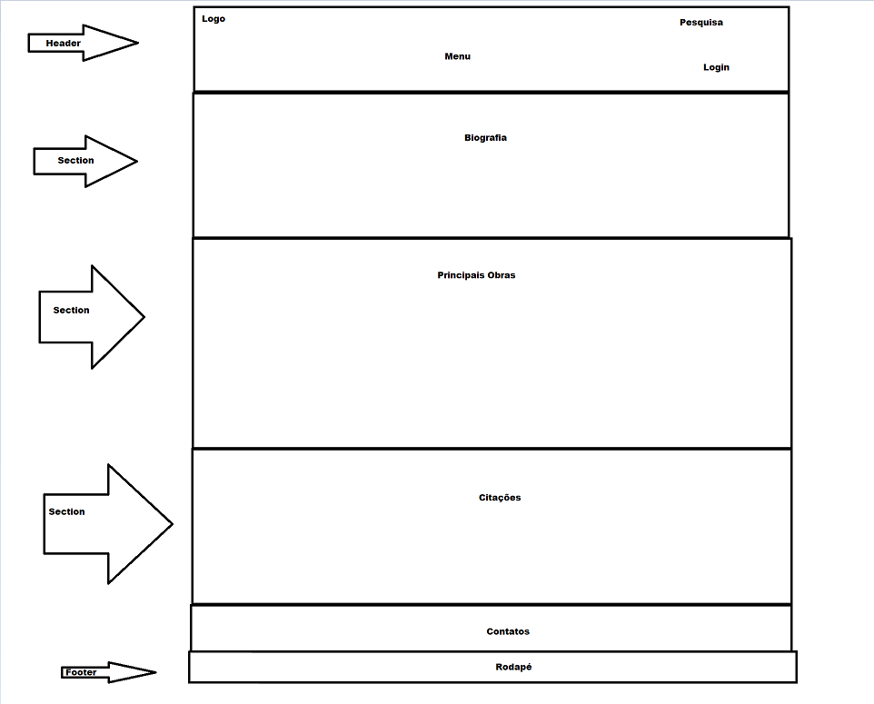
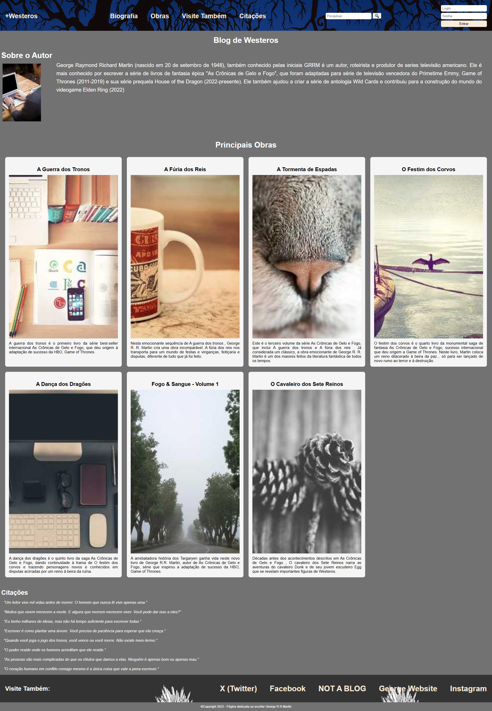

# Trabalho Prático - Semana 03

Dessa vez, vamos escolher uma proposta de projeto para trabalhar.

Nessa atividade, você deverá montar a página inicial do projeto escolhido, a organização do HTML aplicando semântica correta e uso aprimorado do CSS. Leia o enunciado completo no Canvas para mais detalhes.

**IMPORTANTE:** Você deve trabalhar e alterar apenas arquivos dentro da pasta **`public`**. Deixe todos os demais arquivos e pastas desse repositório inalterados. **PRESTE MUITA ATENÇÃO NISSO.**

## Informações Gerais

- Nome:Mateus Ribeiro de Souza Lima
- Matricula:898146
- Proposta de projeto escolhida: Propostas e Produções> Pessoa> Publicações/Obras/Projetos> Autores e Livros
- Breve descrição sobre seu projeto:Por ser um leitor e fã dos livros " As Crônicas de Gelo e Fogo", eu gostaria de fazer um site para falar um pouco mais sobre os livros do universo gelo e fogo, sobre o autor e também sobre os outros livros e projetos por ele produzidos. Também gostaria de apresentar um pouco nesse site uma parte que pudesse ser aberta a comentários e teorias sobre o 6 livro da série. 

## Print do(s) wireframe(s) criado

## Print da home-page criada

